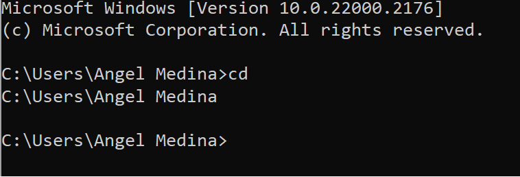
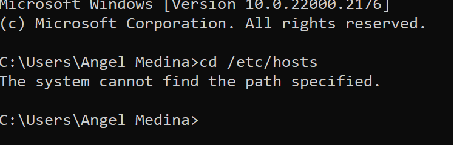
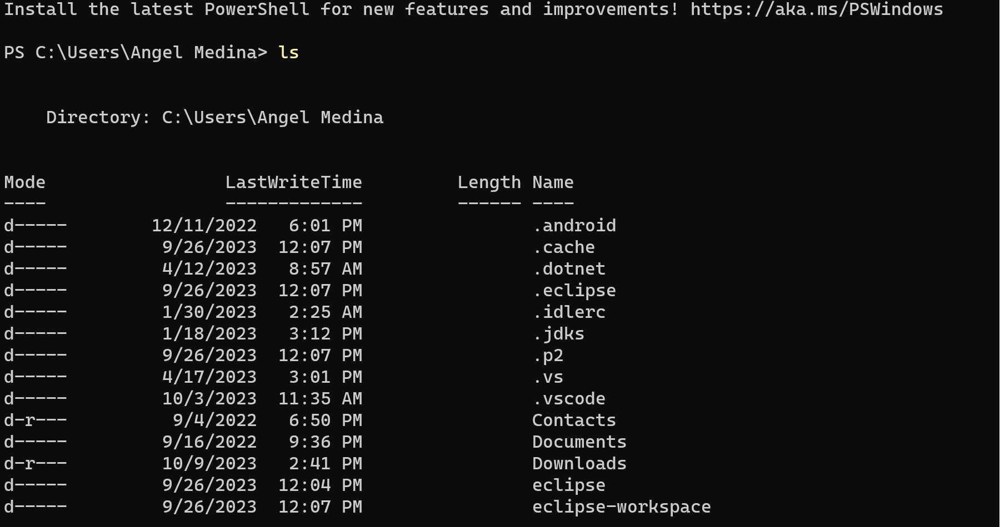
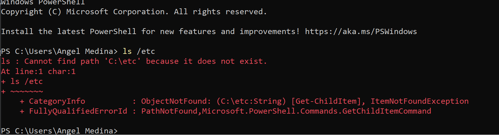
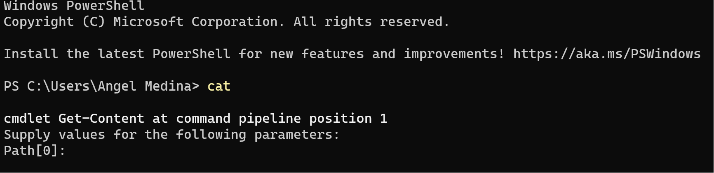
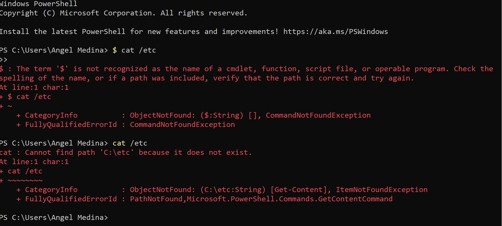
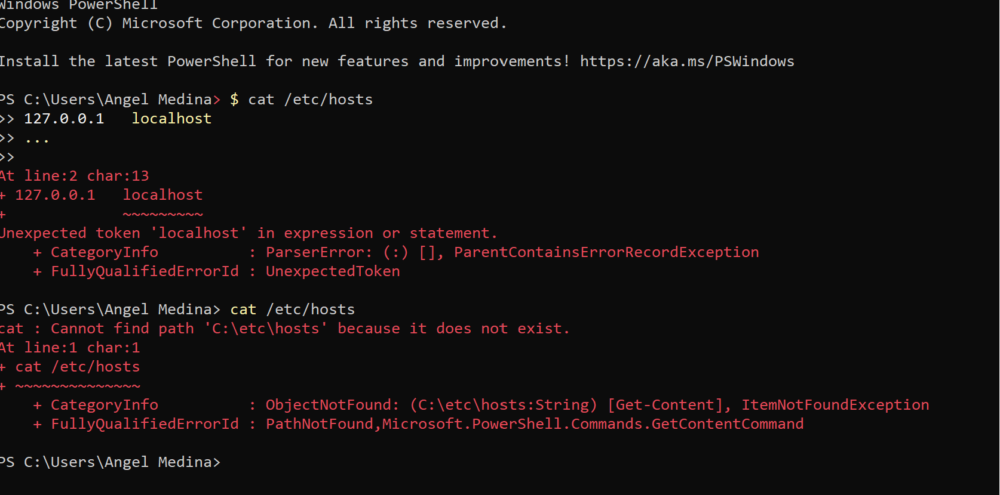

## Command Analysis

1. Using `cd` Without Arguments
    - Command: `cd`
    - Outcome: C:\Users\Angel Medina>
    - Note: Changes directory to the home directory. This command can be executed from any directory without errors.

2. Navigating to `C:` Drive
    - Command: `cd C:`
    - Outcome: C:\>
    - Note: Navigated to the base level of my C: drive from C:\Users\Angel Medina>. No error.

3. Attempt to `cd` into `hosts`
    - Command: `cd C:\Users\Angel Medina>`
    - Note: Error encountered because `hosts` is a file, not a directory.

4. List Contents with `ls`
    - Command: `ls`
    - Note: Lists directory contents from C:\Users\Angel Medina>. No error.

5. View `/etc` Contents
    - Command: `ls /etc`
    - Note: Displays contents of the `/etc` directory. Possible errors might be due to the directory not existing or lacking view permissions. 

6. Check `/etc/hosts` Existence
    - Command: `ls /etc/hosts`
    - Note: Aims to verify the existence of the `/etc/hosts` file. Error occurred on Windows.

7. Using `cat` Without Specifying File
    - Command: `cat`
    - Note: On UNIX, `cat` reads from standard input without arguments. Error encountered on Windows due to directory not found.

8. Attempt to Display Directory Contents with `cat`
    - Command: `cat /etc`
    - Note: Error ("Is a directory") because `cat` is for files, not directories.

9. Display `/etc/hosts` Content
    - Command: `cat /etc/hosts`
    - Outcome: 127.0.0.1   localhost
    - Note: The `/etc/hosts` file maps hostnames to IP addresses.

